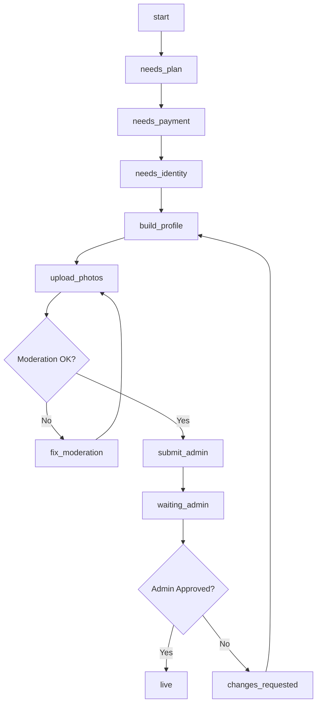

# MasseurMatch - Especificação Completa do Banco de Dados

**Data:** 2025-12-25
**Versão:** 1.0
**Status:** Documentação Completa

---

## Índice

1. [Visão Geral da Arquitetura](#1-visão-geral-da-arquitetura)
2. [Schemas](#2-schemas)
3. [Enums (Tipos Customizados)](#3-enums-tipos-customizados)
4. [Tabelas Core](#4-tabelas-core)
5. [Tabelas de Relacionamento](#5-tabelas-de-relacionamento)
6. [Tabelas de Storage](#6-tabelas-de-storage)
7. [Relacionamentos (ERD)](#7-relacionamentos-erd)
8. [Row Level Security (RLS)](#8-row-level-security-rls)
9. [Triggers e Automações](#9-triggers-e-automações)
10. [Regras de Negócio](#10-regras-de-negócio)
11. [Funções Helper](#11-funções-helper)
12. [Índices e Performance](#12-índices-e-performance)
13. [Fluxo de Onboarding](#13-fluxo-de-onboarding)
14. [Integração com Stripe](#14-integração-com-stripe)
15. [Integração com Sightengine](#15-integração-com-sightengine)
16. [Queries Comuns](#16-queries-comuns)
17. [Manutenção e Backup](#17-manutenção-e-backup)

---

## 1. Visão Geral da Arquitetura

### Estrutura do Banco de Dados

```
MasseurMatch Database
│
├── auth (schema - gerenciado pelo Supabase)
│   └── users (tabela base de autenticação)
│
├── public (schema - nossa aplicação)
│   ├── users (extensão de auth.users)
│   ├── profiles (dados dos terapeutas)
│   ├── therapists (deprecated - migrar para profiles)
│   ├── subscriptions (planos pagos)
│   ├── media_assets (fotos/vídeos)
│   ├── profile_rates (preços dos serviços)
│   ├── profile_hours (horários de funcionamento)
│   ├── profile_languages (idiomas falados)
│   ├── profile_services (tipos de massagem)
│   ├── profile_setups (configurações de atendimento)
│   ├── users_preferences (preferências de usuários clientes)
│   └── explore_swipe_events (analytics de swipes)
│
└── storage (schema - gerenciado pelo Supabase)
    ├── buckets (configuração dos buckets)
    └── objects (arquivos armazenados)
```

### Princípios de Design

1. **Segurança em Camadas**: RLS em todas as tabelas públicas
2. **Auditoria Completa**: `created_at` e `updated_at` em todas as tabelas
3. **Soft Deletes**: Usar flags em vez de deletar (ex: `publication_status = 'private'`)
4. **Normalização**: Tabelas de junction para relações N:N
5. **Validação**: Triggers para regras de negócio complexas

---

## 2. Schemas

### 2.1 Schema `auth`
**Gerenciado por:** Supabase (não modificar diretamente)
**Propósito:** Autenticação e autorização de usuários

### 2.2 Schema `public`
**Gerenciado por:** Nossa aplicação
**Propósito:** Dados de negócio, perfis, subscriptions, etc.

### 2.3 Schema `storage`
**Gerenciado por:** Supabase Storage
**Propósito:** Armazenamento de arquivos (fotos, vídeos, documentos)

---

## 3. Enums (Tipos Customizados)

### 3.1 `identity_status_enum`
**Propósito:** Status de verificação de identidade via Stripe Identity

```sql
CREATE TYPE identity_status_enum AS ENUM (
  'pending',   -- Aguardando verificação
  'verified',  -- Identidade verificada
  'failed'     -- Falha na verificação
);
```

**Uso:** `users.identity_status`
**Regra:** Perfil só pode ser publicado se `identity_status = 'verified'`

---

### 3.2 `user_role_enum`
**Propósito:** Controle de acesso (RBAC)

```sql
CREATE TYPE user_role_enum AS ENUM (
  'user',   -- Cliente ou terapeuta comum
  'admin'   -- Administrador da plataforma
);
```

**Uso:** `users.role`
**Regra:** Admins têm acesso ao painel de aprovação

---

### 3.3 `subscription_plan_enum`
**Propósito:** Planos de assinatura disponíveis

```sql
CREATE TYPE subscription_plan_enum AS ENUM (
  'free',      -- Plano gratuito (1 foto)
  'standard',  -- $29/mês (4 fotos)
  'pro',       -- $49/mês (8 fotos)
  'elite'      -- $99/mês (12 fotos)
);
```

**Uso:** `subscriptions.plan`
**Regra:** Photo limit enforced via trigger `validate_photo_limit()`

---

### 3.4 `subscription_status_enum`
**Propósito:** Estado da assinatura Stripe

```sql
CREATE TYPE subscription_status_enum AS ENUM (
  'trialing',   -- Período de trial
  'active',     -- Ativa e paga
  'past_due',   -- Pagamento atrasado
  'canceled'    -- Cancelada
);
```

**Uso:** `subscriptions.status`
**Regra:** Perfil só fica público se status IN ('trialing', 'active')

---

### 3.5 `onboarding_stage_enum`
**Propósito:** Controle do fluxo de onboarding

```sql
CREATE TYPE onboarding_stage_enum AS ENUM (
  'start',            -- Início do cadastro
  'needs_plan',       -- Precisa escolher plano
  'needs_payment',    -- Precisa adicionar pagamento
  'needs_identity',   -- Precisa verificar identidade
  'build_profile',    -- Construindo perfil
  'upload_photos',    -- Upload de fotos
  'fix_moderation',   -- Fotos reprovadas (moderar)
  'submit_admin',     -- Pronto para submeter
  'waiting_admin',    -- Aguardando aprovação admin
  'live',             -- Perfil publicado
  'blocked'           -- Bloqueado (violação)
);
```

**Uso:** `profiles.onboarding_stage`
**Regra:** Sequência obrigatória controlada pela aplicação

---

### 3.6 `auto_moderation_enum`
**Propósito:** Status da moderação automática (Sightengine)

```sql
CREATE TYPE auto_moderation_enum AS ENUM (
  'draft',          -- Rascunho (não enviado)
  'auto_passed',    -- Passou na moderação automática
  'auto_flagged',   -- Flagged (review manual)
  'auto_blocked'    -- Bloqueado automaticamente
);
```

**Uso:** `profiles.auto_moderation`
**Regra:** Só perfis `auto_passed` podem ir para admin review

---

### 3.7 `admin_status_enum`
**Propósito:** Status da revisão manual (admin)

```sql
CREATE TYPE admin_status_enum AS ENUM (
  'pending_admin',      -- Aguardando revisão
  'approved',           -- Aprovado pelo admin
  'rejected',           -- Rejeitado
  'changes_requested'   -- Admin pediu alterações
);
```

**Uso:** `profiles.admin_status`
**Regra:** Perfil só fica público se `admin_status = 'approved'`

---

### 3.8 `publication_status_enum`
**Propósito:** Controle de visibilidade pública

```sql
CREATE TYPE publication_status_enum AS ENUM (
  'private',  -- Não visível no explore
  'public'    -- Visível publicamente
);
```

**Uso:** `profiles.publication_status`
**Regra:** Toggle manual do terapeuta (on/off)

---

### 3.9 `media_status_enum`
**Propósito:** Status de aprovação de mídia

```sql
CREATE TYPE media_status_enum AS ENUM (
  'pending',   -- Aguardando moderação
  'approved',  -- Aprovada
  'rejected'   -- Rejeitada
);
```

**Uso:** `media_assets.status`

---

### 3.10 `media_type_enum`
**Propósito:** Tipo de mídia

```sql
CREATE TYPE media_type_enum AS ENUM (
  'photo',  -- Foto
  'video'   -- Vídeo (futuro)
);
```

**Uso:** `media_assets.type`

---

### 3.11 `rate_context_enum`
**Propósito:** Contexto do atendimento

```sql
CREATE TYPE rate_context_enum AS ENUM (
  'incall',   -- Atendimento no local do terapeuta
  'outcall'   -- Atendimento no local do cliente
);
```

**Uso:** `profile_rates.context`
**Regra:** Cada contexto tem seus próprios preços

---

## 4. Tabelas Core

### 4.1 `auth.users` (Supabase)
**Gerenciado por:** Supabase Auth
**Não modificar diretamente**

```sql
-- Schema simplificado (não é nossa tabela)
CREATE TABLE auth.users (
  id UUID PRIMARY KEY,
  email TEXT UNIQUE,
  encrypted_password TEXT,
  email_confirmed_at TIMESTAMPTZ,
  created_at TIMESTAMPTZ,
  -- ... outros campos do Supabase
);
```

---

### 4.2 `public.users` (Extensão)
**Propósito:** Estender `auth.users` com dados customizados

```sql
CREATE TABLE public.users (
  id UUID PRIMARY KEY REFERENCES auth.users(id) ON DELETE CASCADE,

  -- Identity Verification
  identity_status identity_status_enum DEFAULT 'pending',
  stripe_identity_session_id VARCHAR(255),

  -- Access Control
  role user_role_enum DEFAULT 'user',

  -- Stripe Integration
  stripe_customer_id VARCHAR(255) UNIQUE,

  -- Timestamps
  created_at TIMESTAMPTZ DEFAULT NOW(),
  updated_at TIMESTAMPTZ DEFAULT NOW()
);

CREATE INDEX idx_users_identity_status ON public.users(identity_status);
CREATE INDEX idx_users_stripe_customer ON public.users(stripe_customer_id);
CREATE UNIQUE INDEX idx_users_stripe_customer_unique
  ON public.users(stripe_customer_id)
  WHERE stripe_customer_id IS NOT NULL;
```

**Relacionamentos:**
- `id` → `auth.users(id)` (1:1)
- `id` ← `subscriptions.user_id` (1:N)
- `id` ← `profiles.user_id` (1:1)

**RLS:**
```sql
-- Users podem ver seus próprios dados
CREATE POLICY "Users can view own data"
  ON public.users FOR SELECT
  USING (auth.uid() = id);

-- Admins podem ver tudo
CREATE POLICY "Admins can view all"
  ON public.users FOR SELECT
  USING (
    EXISTS (
      SELECT 1 FROM public.users
      WHERE id = auth.uid() AND role = 'admin'
    )
  );
```

---

### 4.3 `public.profiles`
**Propósito:** Perfis de terapeutas (core da aplicação)

```sql
CREATE TABLE public.profiles (
  id UUID PRIMARY KEY DEFAULT gen_random_uuid(),
  user_id UUID NOT NULL UNIQUE REFERENCES auth.users(id) ON DELETE CASCADE,

  -- Onboarding Flow
  onboarding_stage onboarding_stage_enum DEFAULT 'start',

  -- Moderation
  auto_moderation auto_moderation_enum DEFAULT 'draft',
  admin_status admin_status_enum DEFAULT 'pending_admin',
  publication_status publication_status_enum DEFAULT 'private',

  -- Review Tracking
  submitted_at TIMESTAMPTZ,
  approved_at TIMESTAMPTZ,
  admin_notes TEXT,
  rejection_reason TEXT,

  -- Basic Info
  display_name VARCHAR(100),
  bio TEXT,
  date_of_birth DATE,

  -- Location
  city_slug VARCHAR(100),  -- e.g., 'new-york-ny'
  address_line1 TEXT,
  address_line2 TEXT,
  zipcode VARCHAR(20),
  latitude DECIMAL(10, 8),
  longitude DECIMAL(11, 8),

  -- Contact
  phone_public_e164 VARCHAR(20),  -- +15551234567
  phone_whatsapp_e164 VARCHAR(20),
  email_public VARCHAR(255),
  website_url VARCHAR(500),

  -- Service Settings
  incall_enabled BOOLEAN DEFAULT false,
  outcall_enabled BOOLEAN DEFAULT false,

  -- Pricing (deprecated - usar profile_rates)
  base_rate_per_min_cents INT,

  -- SEO
  slug VARCHAR(100) UNIQUE,  -- e.g., 'john-therapist-nyc'

  -- Timestamps
  created_at TIMESTAMPTZ DEFAULT NOW(),
  updated_at TIMESTAMPTZ DEFAULT NOW()
);

-- Indexes
CREATE INDEX idx_profiles_user_id ON public.profiles(user_id);
CREATE INDEX idx_profiles_onboarding_stage ON public.profiles(onboarding_stage);
CREATE INDEX idx_profiles_auto_moderation ON public.profiles(auto_moderation);
CREATE INDEX idx_profiles_admin_status ON public.profiles(admin_status);
CREATE INDEX idx_profiles_publication_status ON public.profiles(publication_status);
CREATE INDEX idx_profiles_city_slug ON public.profiles(city_slug);
CREATE INDEX idx_profiles_slug ON public.profiles(slug) WHERE slug IS NOT NULL;

-- Admin queue (perfis aguardando aprovação)
CREATE INDEX idx_profiles_pending_review
  ON public.profiles(submitted_at DESC)
  WHERE admin_status = 'pending_admin';

-- Public profiles (para explore)
CREATE INDEX idx_profiles_public_approved
  ON public.profiles(publication_status, admin_status)
  WHERE publication_status = 'public' AND admin_status = 'approved';

-- Unique constraints
CREATE UNIQUE INDEX idx_profiles_user_unique ON public.profiles(user_id);
```

**Relacionamentos:**
- `user_id` → `auth.users(id)` (1:1)
- `id` ← `media_assets.profile_id` (1:N)
- `id` ← `profile_rates.profile_id` (1:N)
- `id` ← `profile_hours.profile_id` (1:N)
- `id` ← `profile_languages.profile_id` (1:N)
- `id` ← `profile_services.profile_id` (1:N)
- `id` ← `profile_setups.profile_id` (1:N)

**RLS:**
```sql
-- Users podem ver e editar seus próprios perfis
CREATE POLICY "Users can manage own profile"
  ON public.profiles FOR ALL
  USING (user_id = auth.uid())
  WITH CHECK (user_id = auth.uid());

-- Público pode ver perfis aprovados e públicos
CREATE POLICY "Public can view approved profiles"
  ON public.profiles FOR SELECT
  USING (
    publication_status = 'public'
    AND admin_status = 'approved'
  );

-- Admins podem ver e editar tudo
CREATE POLICY "Admins can manage all profiles"
  ON public.profiles FOR ALL
  USING (
    EXISTS (
      SELECT 1 FROM public.users
      WHERE id = auth.uid() AND role = 'admin'
    )
  );
```

---

### 4.4 `public.subscriptions`
**Propósito:** Assinaturas Stripe dos usuários

```sql
CREATE TABLE public.subscriptions (
  id UUID PRIMARY KEY DEFAULT gen_random_uuid(),
  user_id UUID NOT NULL REFERENCES auth.users(id) ON DELETE CASCADE,

  -- Plan Info
  plan subscription_plan_enum NOT NULL,
  status subscription_status_enum NOT NULL DEFAULT 'active',

  -- Stripe IDs
  stripe_subscription_id VARCHAR(255) UNIQUE,
  stripe_payment_method_id VARCHAR(255),

  -- Trial Period
  trial_start TIMESTAMPTZ,
  trial_end TIMESTAMPTZ,

  -- Billing Cycle
  current_period_start TIMESTAMPTZ NOT NULL,
  current_period_end TIMESTAMPTZ NOT NULL,
  cancel_at_period_end BOOLEAN DEFAULT false,
  canceled_at TIMESTAMPTZ,

  -- Metadata
  metadata JSONB DEFAULT '{}',

  -- Timestamps
  created_at TIMESTAMPTZ DEFAULT NOW(),
  updated_at TIMESTAMPTZ DEFAULT NOW()
);

-- Indexes
CREATE INDEX idx_subscriptions_user ON public.subscriptions(user_id);
CREATE INDEX idx_subscriptions_status ON public.subscriptions(status);
CREATE INDEX idx_subscriptions_stripe ON public.subscriptions(stripe_subscription_id);

-- Constraint: apenas uma subscription ativa por usuário
CREATE UNIQUE INDEX idx_subscriptions_active_user
  ON public.subscriptions(user_id)
  WHERE status IN ('trialing', 'active');
```

**Relacionamentos:**
- `user_id` → `auth.users(id)` (N:1)

**Regras:**
- Um usuário pode ter múltiplas subscriptions (histórico)
- Apenas UMA subscription pode estar ativa (`status IN ('trialing', 'active')`)
- `free` plan: Usuários sem subscription na tabela

**RLS:**
```sql
-- Users podem ver suas próprias subscriptions
CREATE POLICY "Users can view own subscriptions"
  ON public.subscriptions FOR SELECT
  USING (user_id = auth.uid());

-- Apenas sistema pode criar/atualizar (via webhooks Stripe)
-- Não há policy de INSERT/UPDATE para usuários
```

---

### 4.5 `public.media_assets`
**Propósito:** Fotos e vídeos dos perfis

```sql
CREATE TABLE public.media_assets (
  id UUID PRIMARY KEY DEFAULT gen_random_uuid(),
  profile_id UUID NOT NULL REFERENCES public.profiles(id) ON DELETE CASCADE,

  -- Type & Status
  type media_type_enum DEFAULT 'photo',
  status media_status_enum DEFAULT 'pending',

  -- Storage
  storage_path TEXT NOT NULL,  -- e.g., '/{user_id}/photo1.jpg'
  public_url TEXT,
  thumbnail_url TEXT,

  -- Display Order
  position INT DEFAULT 0,
  is_cover BOOLEAN DEFAULT false,

  -- Sightengine Moderation
  sightengine_response JSONB,
  sightengine_score DECIMAL(5, 2),
  rejection_reason TEXT,

  -- File Metadata
  width INT,
  height INT,
  file_size INT,  -- bytes
  mime_type VARCHAR(100),

  -- Timestamps
  created_at TIMESTAMPTZ DEFAULT NOW(),
  updated_at TIMESTAMPTZ DEFAULT NOW()
);

-- Indexes
CREATE INDEX idx_media_profile ON public.media_assets(profile_id);
CREATE INDEX idx_media_status ON public.media_assets(status);
CREATE INDEX idx_media_position ON public.media_assets(profile_id, position);

-- Constraint: apenas uma foto de capa por perfil
CREATE UNIQUE INDEX idx_media_cover_unique
  ON public.media_assets(profile_id)
  WHERE is_cover = true;

-- Approved media for public profiles
CREATE INDEX idx_media_approved_by_profile
  ON public.media_assets(profile_id, position)
  WHERE status = 'approved';
```

**Relacionamentos:**
- `profile_id` → `profiles(id)` (N:1)
- `storage_path` → `storage.objects.name` (1:1 lógico)

**Limites por Plano:**
- Free: 1 foto
- Standard: 4 fotos
- Pro: 8 fotos
- Elite: 12 fotos

**RLS:**
```sql
-- Users podem ver suas próprias mídias
CREATE POLICY "Users can view own media"
  ON public.media_assets FOR SELECT
  USING (
    profile_id IN (SELECT id FROM profiles WHERE user_id = auth.uid())
  );

-- Users podem fazer upload (trigger valida limite)
CREATE POLICY "Users can upload own media"
  ON public.media_assets FOR INSERT
  WITH CHECK (
    profile_id IN (SELECT id FROM profiles WHERE user_id = auth.uid())
  );

-- Users podem atualizar/deletar suas mídias
CREATE POLICY "Users can update own media"
  ON public.media_assets FOR UPDATE
  USING (
    profile_id IN (SELECT id FROM profiles WHERE user_id = auth.uid())
  );

CREATE POLICY "Users can delete own media"
  ON public.media_assets FOR DELETE
  USING (
    profile_id IN (SELECT id FROM profiles WHERE user_id = auth.uid())
  );

-- Público pode ver mídias aprovadas de perfis públicos
CREATE POLICY "Public can view approved media from public profiles"
  ON public.media_assets FOR SELECT
  USING (
    status = 'approved'
    AND profile_id IN (
      SELECT id FROM profiles WHERE publication_status = 'public'
    )
  );
```

---

### 4.6 `public.profile_rates`
**Propósito:** Preços dos serviços (incall/outcall)

```sql
CREATE TABLE public.profile_rates (
  id UUID PRIMARY KEY DEFAULT gen_random_uuid(),
  profile_id UUID NOT NULL REFERENCES public.profiles(id) ON DELETE CASCADE,

  -- Service Context
  context rate_context_enum NOT NULL,

  -- Pricing
  duration_minutes INT NOT NULL CHECK (duration_minutes > 0),
  price_cents INT NOT NULL CHECK (price_cents > 0),
  currency VARCHAR(3) DEFAULT 'USD',

  -- Settings
  is_active BOOLEAN DEFAULT true,
  notes TEXT,

  -- Timestamps
  created_at TIMESTAMPTZ DEFAULT NOW(),
  updated_at TIMESTAMPTZ DEFAULT NOW(),

  -- Constraint: um preço por contexto/duração
  UNIQUE(profile_id, context, duration_minutes)
);

-- Indexes
CREATE INDEX idx_rates_profile ON public.profile_rates(profile_id);
CREATE INDEX idx_rates_context ON public.profile_rates(context);
CREATE INDEX idx_rates_active_by_profile
  ON public.profile_rates(profile_id, context, duration_minutes)
  WHERE is_active = true;
```

**Relacionamentos:**
- `profile_id` → `profiles(id)` (N:1)

**Regra dos 33%:**
- Preço por minuto não pode exceder 133% do preço base
- Validado via trigger `validate_rate_33_rule()`

**Exemplo:**
```
Base: 60min @ $120 = $2.00/min
Max allowed for 30min: 30min @ $80 = $2.66/min (OK)
Invalid: 30min @ $100 = $3.33/min (rejected, > $2.66)
```

**RLS:**
```sql
-- Users podem gerenciar suas próprias rates
CREATE POLICY "Users can manage own rates"
  ON public.profile_rates FOR ALL
  USING (
    profile_id IN (SELECT id FROM profiles WHERE user_id = auth.uid())
  );

-- Público pode ver rates de perfis públicos
CREATE POLICY "Public can view rates from public profiles"
  ON public.profile_rates FOR SELECT
  USING (
    profile_id IN (
      SELECT id FROM profiles
      WHERE publication_status = 'public' AND admin_status = 'approved'
    )
  );
```

---

### 4.7 `public.profile_hours`
**Propósito:** Horários de funcionamento (por dia da semana)

```sql
CREATE TABLE public.profile_hours (
  id UUID PRIMARY KEY DEFAULT gen_random_uuid(),
  profile_id UUID NOT NULL REFERENCES public.profiles(id) ON DELETE CASCADE,

  -- Day of Week (0 = Sunday, 6 = Saturday)
  day_of_week INT NOT NULL CHECK (day_of_week BETWEEN 0 AND 6),
  is_closed BOOLEAN DEFAULT false,

  -- Hours
  open_time TIME,
  close_time TIME,

  -- Break (optional)
  break_start TIME,
  break_end TIME,

  -- Timestamps
  created_at TIMESTAMPTZ DEFAULT NOW(),
  updated_at TIMESTAMPTZ DEFAULT NOW(),

  -- Constraint: uma entrada por perfil/dia
  UNIQUE(profile_id, day_of_week)
);

-- Indexes
CREATE INDEX idx_hours_profile ON public.profile_hours(profile_id);
```

**Relacionamentos:**
- `profile_id` → `profiles(id)` (N:1)

**RLS:**
```sql
-- Users podem gerenciar seus próprios horários
CREATE POLICY "Users can manage own hours"
  ON public.profile_hours FOR ALL
  USING (
    profile_id IN (SELECT id FROM profiles WHERE user_id = auth.uid())
  );

-- Público pode ver horários de perfis públicos
CREATE POLICY "Public can view hours from public profiles"
  ON public.profile_hours FOR SELECT
  USING (
    profile_id IN (
      SELECT id FROM profiles
      WHERE publication_status = 'public' AND admin_status = 'approved'
    )
  );
```

---

## 5. Tabelas de Relacionamento

### 5.1 `public.profile_languages`
**Propósito:** Idiomas falados pelo terapeuta

```sql
CREATE TABLE public.profile_languages (
  id UUID PRIMARY KEY DEFAULT gen_random_uuid(),
  profile_id UUID NOT NULL REFERENCES public.profiles(id) ON DELETE CASCADE,
  language TEXT NOT NULL,  -- 'en', 'pt', 'es', etc.
  created_at TIMESTAMPTZ NOT NULL DEFAULT NOW()
);

CREATE INDEX idx_profile_languages_profile ON public.profile_languages(profile_id);
ALTER TABLE public.profile_languages ENABLE ROW LEVEL SECURITY;
```

**RLS:**
```sql
CREATE POLICY "Users can manage their profile languages"
  ON public.profile_languages FOR ALL
  USING (
    profile_id IN (
      SELECT id FROM public.profiles WHERE user_id = auth.uid()
    )
  );
```

---

### 5.2 `public.profile_services`
**Propósito:** Tipos de massagem oferecidos

```sql
CREATE TABLE public.profile_services (
  id UUID PRIMARY KEY DEFAULT gen_random_uuid(),
  profile_id UUID NOT NULL REFERENCES public.profiles(id) ON DELETE CASCADE,
  service TEXT NOT NULL,  -- 'Swedish', 'Deep Tissue', 'Sports', etc.
  created_at TIMESTAMPTZ NOT NULL DEFAULT NOW()
);

CREATE INDEX idx_profile_services_profile ON public.profile_services(profile_id);
ALTER TABLE public.profile_services ENABLE ROW LEVEL SECURITY;
```

**RLS:**
```sql
CREATE POLICY "Users can manage their profile services"
  ON public.profile_services FOR ALL
  USING (
    profile_id IN (
      SELECT id FROM public.profiles WHERE user_id = auth.uid()
    )
  );
```

---

### 5.3 `public.profile_setups`
**Propósito:** Configurações de atendimento (portable table, office, etc.)

```sql
CREATE TABLE public.profile_setups (
  id UUID PRIMARY KEY DEFAULT gen_random_uuid(),
  profile_id UUID NOT NULL REFERENCES public.profiles(id) ON DELETE CASCADE,
  setup_name TEXT NOT NULL,
  description TEXT,
  created_at TIMESTAMPTZ NOT NULL DEFAULT NOW()
);

CREATE INDEX idx_profile_setups_profile ON public.profile_setups(profile_id);
ALTER TABLE public.profile_setups ENABLE ROW LEVEL SECURITY;
```

**RLS:**
```sql
CREATE POLICY "Users can manage their profile setups"
  ON public.profile_setups FOR ALL
  USING (
    profile_id IN (
      SELECT id FROM public.profiles WHERE user_id = auth.uid()
    )
  );
```

---

### 5.4 `public.users_preferences`
**Propósito:** Preferências de busca dos clientes

```sql
CREATE TABLE public.users_preferences (
  id UUID PRIMARY KEY DEFAULT gen_random_uuid(),
  user_id UUID NOT NULL REFERENCES auth.users(id) ON DELETE CASCADE,

  -- Preferences (JSONB para flexibilidade)
  preferred_services TEXT[],
  max_distance_km INT,
  preferred_price_range_min INT,
  preferred_price_range_max INT,

  created_at TIMESTAMPTZ DEFAULT NOW(),
  updated_at TIMESTAMPTZ DEFAULT NOW()
);

CREATE INDEX idx_preferences_user ON public.users_preferences(user_id);
ALTER TABLE public.users_preferences ENABLE ROW LEVEL SECURITY;
```

**RLS:**
```sql
CREATE POLICY "Users can manage their preferences"
  ON public.users_preferences FOR ALL
  USING (auth.uid() = user_id)
  WITH CHECK (auth.uid() = user_id);
```

---

### 5.5 `public.explore_swipe_events`
**Propósito:** Analytics de swipes no explore

```sql
CREATE TABLE public.explore_swipe_events (
  id UUID PRIMARY KEY DEFAULT gen_random_uuid(),
  user_id UUID NOT NULL REFERENCES auth.users(id) ON DELETE CASCADE,
  profile_id UUID NOT NULL REFERENCES public.profiles(id) ON DELETE CASCADE,

  -- Swipe Action
  action swipe_action_enum NOT NULL,  -- 'swipe_left', 'swipe_right', 'swipe_up'

  -- Match Score (algoritmo)
  match_score DECIMAL(5, 2),

  created_at TIMESTAMPTZ DEFAULT NOW()
);

CREATE INDEX idx_swipes_user ON public.explore_swipe_events(user_id);
CREATE INDEX idx_swipes_profile ON public.explore_swipe_events(profile_id);
CREATE INDEX idx_swipes_created ON public.explore_swipe_events(created_at DESC);
```

---

## 6. Tabelas de Storage

### 6.1 `storage.buckets`
**Gerenciado por:** Supabase Storage

```sql
-- Bucket configuration
{
  id: 'profiles',
  name: 'profiles',
  public: true,  -- Public read access
  file_size_limit: 5242880,  -- 5MB
  allowed_mime_types: ['image/jpeg', 'image/png', 'image/webp']
}
```

---

### 6.2 `storage.objects`
**Gerenciado por:** Supabase Storage
**RLS Policies:** Ver seção 8.2

---

## 7. Relacionamentos (ERD)

```
auth.users (Supabase)
    │
    ├─1:1─→ public.users (extends auth.users)
    │           │
    │           ├─1:N─→ subscriptions
    │           └─1:1─→ profiles
    │                       │
    │                       ├─1:N─→ media_assets
    │                       ├─1:N─→ profile_rates
    │                       ├─1:N─→ profile_hours
    │                       ├─1:N─→ profile_languages
    │                       ├─1:N─→ profile_services
    │                       └─1:N─→ profile_setups
    │
    └─1:N─→ explore_swipe_events
    └─1:1─→ users_preferences
```

---

## 8. Row Level Security (RLS)

### 8.1 Políticas Gerais

**Todas as tabelas `public.*` têm RLS habilitado:**
```sql
ALTER TABLE public.[table_name] ENABLE ROW LEVEL SECURITY;
```

**Padrão de Políticas:**
1. **Own Data**: Usuários acessam seus próprios dados
2. **Public Read**: Público acessa dados aprovados
3. **Admin All**: Admins têm acesso total

---

### 8.2 Storage Policies (Bucket: `profiles`)

**Política Consolidada:**

```sql
-- INSERT: Users podem upload na sua pasta
CREATE POLICY "profiles_insert"
  ON storage.objects FOR INSERT
  TO authenticated
  WITH CHECK (
    bucket_id = 'profiles'
    AND (storage.foldername(name))[1] = (auth.uid())::text
  );

-- SELECT (own): Users veem seus próprios arquivos
CREATE POLICY "profiles_select_own"
  ON storage.objects FOR SELECT
  TO authenticated
  USING (
    bucket_id = 'profiles'
    AND (storage.foldername(name))[1] = (auth.uid())::text
  );

-- SELECT (public): Todos veem fotos públicas
CREATE POLICY "profiles_select_public"
  ON storage.objects FOR SELECT
  TO public
  USING (bucket_id = 'profiles');

-- UPDATE: Users atualizam seus arquivos
CREATE POLICY "profiles_update"
  ON storage.objects FOR UPDATE
  TO authenticated
  USING (
    bucket_id = 'profiles'
    AND (storage.foldername(name))[1] = (auth.uid())::text
  )
  WITH CHECK (
    bucket_id = 'profiles'
    AND (storage.foldername(name))[1] = (auth.uid())::text
  );

-- DELETE: Users deletam seus arquivos
CREATE POLICY "profiles_delete"
  ON storage.objects FOR DELETE
  TO authenticated
  USING (
    bucket_id = 'profiles'
    AND (storage.foldername(name))[1] = (auth.uid())::text
  );
```

**Estrutura de Path:**
```
profiles/
  {user_id}/
    photo1.jpg
    photo2.jpg
```

---

## 9. Triggers e Automações

### 9.1 Auto-update `updated_at`

```sql
CREATE OR REPLACE FUNCTION update_updated_at_column()
RETURNS TRIGGER AS $$
BEGIN
  NEW.updated_at = NOW();
  RETURN NEW;
END;
$$ LANGUAGE plpgsql;

-- Aplicar a todas as tabelas com updated_at
CREATE TRIGGER update_subscriptions_updated_at
  BEFORE UPDATE ON public.subscriptions
  FOR EACH ROW EXECUTE FUNCTION update_updated_at_column();

CREATE TRIGGER update_profiles_updated_at
  BEFORE UPDATE ON public.profiles
  FOR EACH ROW EXECUTE FUNCTION update_updated_at_column();

CREATE TRIGGER update_media_updated_at
  BEFORE UPDATE ON public.media_assets
  FOR EACH ROW EXECUTE FUNCTION update_updated_at_column();

CREATE TRIGGER update_rates_updated_at
  BEFORE UPDATE ON public.profile_rates
  FOR EACH ROW EXECUTE FUNCTION update_updated_at_column();
```

---

### 9.2 Validação: Regra dos 33% (Rates)

```sql
CREATE OR REPLACE FUNCTION validate_rate_33_rule()
RETURNS TRIGGER AS $$
DECLARE
  base_rate RECORD;
  base_price_per_min DECIMAL;
  new_price_per_min DECIMAL;
  max_allowed_per_min DECIMAL;
BEGIN
  -- Pular se inativo
  IF NOT NEW.is_active THEN
    RETURN NEW;
  END IF;

  -- Buscar rate base (menor duração para o mesmo contexto)
  SELECT * INTO base_rate
  FROM profile_rates
  WHERE profile_id = NEW.profile_id
    AND context = NEW.context
    AND is_active = true
    AND id != COALESCE(NEW.id, '00000000-0000-0000-0000-000000000000'::UUID)
  ORDER BY duration_minutes ASC
  LIMIT 1;

  -- Se não há base, este é o primeiro (OK)
  IF base_rate IS NULL THEN
    RETURN NEW;
  END IF;

  -- Determinar qual é a base (menor duração)
  IF NEW.duration_minutes < base_rate.duration_minutes THEN
    base_price_per_min := NEW.price_cents::DECIMAL / NEW.duration_minutes;
    new_price_per_min := base_rate.price_cents::DECIMAL / base_rate.duration_minutes;
  ELSE
    base_price_per_min := base_rate.price_cents::DECIMAL / base_rate.duration_minutes;
    new_price_per_min := NEW.price_cents::DECIMAL / NEW.duration_minutes;
  END IF;

  max_allowed_per_min := base_price_per_min * 1.33;

  -- Validar
  IF new_price_per_min > max_allowed_per_min THEN
    RAISE EXCEPTION 'Price per minute ($%.2f) exceeds 33%% above base rate ($%.2f). Maximum allowed: $%.2f',
      new_price_per_min / 100.0,
      base_price_per_min / 100.0,
      max_allowed_per_min / 100.0
    USING HINT = 'Adjust your pricing to stay within 33% of the base rate per minute.';
  END IF;

  RETURN NEW;
END;
$$ LANGUAGE plpgsql;

CREATE TRIGGER enforce_rate_33_rule
  BEFORE INSERT OR UPDATE ON profile_rates
  FOR EACH ROW
  EXECUTE FUNCTION validate_rate_33_rule();
```

---

### 9.3 Validação: Photo Limit (por plano)

```sql
CREATE OR REPLACE FUNCTION validate_photo_limit()
RETURNS TRIGGER AS $$
DECLARE
  user_plan subscription_plan_enum;
  current_photo_count INT;
  max_photos INT;
BEGIN
  -- Buscar plano do usuário
  SELECT s.plan INTO user_plan
  FROM profiles p
  LEFT JOIN users u ON p.user_id = u.id
  LEFT JOIN subscriptions s ON u.id = s.user_id
  WHERE p.id = NEW.profile_id
    AND (s.status IN ('trialing', 'active') OR s.status IS NULL)
  LIMIT 1;

  -- Definir limites
  max_photos := CASE
    WHEN user_plan = 'standard' THEN 4
    WHEN user_plan = 'pro' THEN 8
    WHEN user_plan = 'elite' THEN 12
    ELSE 1  -- Free plan
  END;

  -- Contar fotos atuais
  SELECT COUNT(*) INTO current_photo_count
  FROM media_assets
  WHERE profile_id = NEW.profile_id
    AND type = 'photo'
    AND status != 'rejected'
    AND id != COALESCE(NEW.id, '00000000-0000-0000-0000-000000000000'::UUID);

  -- Validar
  IF current_photo_count >= max_photos THEN
    RAISE EXCEPTION 'Photo limit exceeded. Your plan allows % photos, you have %.',
      max_photos, current_photo_count
    USING HINT = 'Upgrade your plan to upload more photos.';
  END IF;

  RETURN NEW;
END;
$$ LANGUAGE plpgsql;

CREATE TRIGGER enforce_photo_limit
  BEFORE INSERT ON media_assets
  FOR EACH ROW
  WHEN (NEW.type = 'photo')
  EXECUTE FUNCTION validate_photo_limit();
```

---

### 9.4 Auto-set Cover Photo

```sql
CREATE OR REPLACE FUNCTION auto_set_cover_photo()
RETURNS TRIGGER AS $$
BEGIN
  -- Se é a primeira foto aprovada, tornar cover
  IF NEW.status = 'approved' AND NOT EXISTS (
    SELECT 1 FROM media_assets
    WHERE profile_id = NEW.profile_id
      AND is_cover = true
      AND id != NEW.id
  ) THEN
    NEW.is_cover = true;
  END IF;

  RETURN NEW;
END;
$$ LANGUAGE plpgsql;

CREATE TRIGGER set_first_photo_as_cover
  BEFORE INSERT OR UPDATE ON media_assets
  FOR EACH ROW
  EXECUTE FUNCTION auto_set_cover_photo();
```

---

## 10. Regras de Negócio

### 10.1 Publicação de Perfil

**Para um perfil ser publicado (`publication_status = 'public'`), deve ter:**

1. ✅ `identity_status = 'verified'` (user verificado)
2. ✅ `auto_moderation = 'auto_passed'` (passou Sightengine)
3. ✅ `admin_status = 'approved'` (aprovado por admin)
4. ✅ Subscription ativa (`status IN ('trialing', 'active')`) OU free plan
5. ✅ Pelo menos 1 foto aprovada
6. ✅ Campos obrigatórios preenchidos:
   - `display_name`
   - `city_slug`
   - `phone_public_e164`
   - Pelo menos 1 language
   - Pelo menos 1 service
   - Pelo menos 1 setup
   - Se `incall_enabled = true`: pelo menos 1 rate de incall
   - Se `outcall_enabled = true`: pelo menos 1 rate de outcall

**Helper Function:**
```sql
SELECT can_publish_profile('{profile_id}');  -- Returns boolean
```

---

### 10.2 Submissão para Admin Review

**Requisitos para `onboarding_stage = 'submit_admin'`:**

Mesmos requisitos de publicação, EXCETO `admin_status = 'approved'`.

**Helper Function:**
```sql
SELECT can_submit_for_review('{profile_id}');  -- Returns boolean
```

---

### 10.3 Photo Limits

| Plan | Max Photos |
|------|-----------|
| Free | 1 |
| Standard | 4 |
| Pro | 8 |
| Elite | 12 |

**Enforced by:** Trigger `validate_photo_limit()`

---

### 10.4 Pricing Rule (33%)

**Regra:** Preço por minuto não pode exceder 133% do preço base

**Exemplo:**
```sql
-- Base rate
INSERT INTO profile_rates (profile_id, context, duration_minutes, price_cents)
VALUES ('{id}', 'incall', 60, 12000);  -- $120/hr = $2.00/min

-- OK: 30min @ $80 = $2.66/min (133% of $2.00 = $2.66)
INSERT INTO profile_rates (profile_id, context, duration_minutes, price_cents)
VALUES ('{id}', 'incall', 30, 8000);

-- REJECTED: 30min @ $100 = $3.33/min (exceeds $2.66)
INSERT INTO profile_rates (profile_id, context, duration_minutes, price_cents)
VALUES ('{id}', 'incall', 30, 10000);
-- ERROR: Price per minute ($3.33) exceeds 33% above base rate ($2.00)
```

**Enforced by:** Trigger `validate_rate_33_rule()`

---

## 11. Funções Helper

### 11.1 `can_submit_for_review(profile_uuid UUID)`

**Propósito:** Verificar se perfil pode ser submetido para aprovação admin

```sql
SELECT can_submit_for_review('{profile_id}');
-- Returns: true/false
```

**Verifica:**
- Identity verificada
- Moderação aprovada
- Campos obrigatórios preenchidos
- Fotos aprovadas
- Languages, services, setups
- Rates (se incall/outcall habilitado)

---

### 11.2 `can_publish_profile(profile_uuid UUID)`

**Propósito:** Verificar se perfil pode ser publicado

```sql
SELECT can_publish_profile('{profile_id}');
-- Returns: true/false
```

**Verifica:** Todos os requisitos de `can_submit_for_review()` + `admin_status = 'approved'`

---

## 12. Índices e Performance

### 12.1 Índices Críticos

```sql
-- User lookups
CREATE INDEX idx_users_stripe_customer ON public.users(stripe_customer_id);

-- Profile discovery
CREATE INDEX idx_profiles_city_slug ON public.profiles(city_slug);
CREATE INDEX idx_profiles_public_approved ON public.profiles(publication_status, admin_status)
  WHERE publication_status = 'public' AND admin_status = 'approved';

-- Admin queue
CREATE INDEX idx_profiles_pending_review ON public.profiles(submitted_at DESC)
  WHERE admin_status = 'pending_admin';

-- Media queries
CREATE INDEX idx_media_approved_by_profile ON public.media_assets(profile_id, position)
  WHERE status = 'approved';

-- Active rates
CREATE INDEX idx_rates_active_by_profile ON public.profile_rates(profile_id, context, duration_minutes)
  WHERE is_active = true;
```

---

### 12.2 Query Optimization Tips

**Para explore feed:**
```sql
-- Usar índice idx_profiles_public_approved
SELECT p.*, u.stripe_customer_id
FROM profiles p
JOIN users u ON p.user_id = u.id
WHERE p.publication_status = 'public'
  AND p.admin_status = 'approved'
  AND p.city_slug = 'new-york-ny'
ORDER BY p.created_at DESC
LIMIT 20;
```

**Para detalhes do perfil:**
```sql
-- Eager load relacionamentos
SELECT
  p.*,
  json_agg(DISTINCT m.*) FILTER (WHERE m.id IS NOT NULL) as media,
  json_agg(DISTINCT r.*) FILTER (WHERE r.id IS NOT NULL) as rates,
  json_agg(DISTINCT h.*) FILTER (WHERE h.id IS NOT NULL) as hours
FROM profiles p
LEFT JOIN media_assets m ON p.id = m.profile_id AND m.status = 'approved'
LEFT JOIN profile_rates r ON p.id = r.profile_id AND r.is_active = true
LEFT JOIN profile_hours h ON p.id = h.profile_id
WHERE p.id = '{profile_id}'
GROUP BY p.id;
```

---

## 13. Fluxo de Onboarding

### Stage Progression



### Stage Descriptions

| Stage | Description | Requirements |
|-------|-------------|--------------|
| `start` | Início do cadastro | - |
| `needs_plan` | Precisa escolher plano | User criado |
| `needs_payment` | Precisa adicionar payment method | Plano selecionado (se não free) |
| `needs_identity` | Precisa verificar identidade | Payment adicionado |
| `build_profile` | Construindo perfil | Identity verificada |
| `upload_photos` | Upload de fotos | Perfil preenchido |
| `fix_moderation` | Fotos reprovadas | - |
| `submit_admin` | Pronto para submeter | Todos os campos OK |
| `waiting_admin` | Aguardando admin | Submetido (`submitted_at` set) |
| `live` | Perfil publicado | Admin aprovou |
| `blocked` | Bloqueado (violação) | - |

---

## 14. Integração com Stripe

### 14.1 Customer Creation

**Quando:** Signup do usuário

```typescript
// 1. Criar customer no Stripe
const customer = await stripe.customers.create({
  email: user.email,
  metadata: { supabase_user_id: user.id }
});

// 2. Salvar no DB
await supabase
  .from('users')
  .update({ stripe_customer_id: customer.id })
  .eq('id', user.id);
```

---

### 14.2 Subscription Creation

**Quando:** Usuário seleciona plano pago

```typescript
// 1. Criar subscription no Stripe
const subscription = await stripe.subscriptions.create({
  customer: stripeCustomerId,
  items: [{ price: PRICE_ID }],
  trial_period_days: 7,
  payment_behavior: 'default_incomplete',
  expand: ['latest_invoice.payment_intent']
});

// 2. Salvar no DB
await supabase.from('subscriptions').insert({
  user_id: userId,
  plan: 'pro',
  status: 'trialing',
  stripe_subscription_id: subscription.id,
  trial_start: new Date(subscription.trial_start * 1000),
  trial_end: new Date(subscription.trial_end * 1000),
  current_period_start: new Date(subscription.current_period_start * 1000),
  current_period_end: new Date(subscription.current_period_end * 1000)
});
```

---

### 14.3 Identity Verification

**Quando:** Depois de subscription ativa

```typescript
// 1. Criar VerificationSession
const session = await stripe.identity.verificationSessions.create({
  type: 'document',
  metadata: { supabase_user_id: userId }
});

// 2. Salvar session ID
await supabase
  .from('users')
  .update({ stripe_identity_session_id: session.id })
  .eq('id', userId);

// 3. Redirect user to session.url
```

---

### 14.4 Webhooks

**Eventos a processar:**

```typescript
// customer.subscription.updated
case 'customer.subscription.updated': {
  const subscription = event.data.object;
  await supabase
    .from('subscriptions')
    .update({
      status: subscription.status,
      current_period_start: new Date(subscription.current_period_start * 1000),
      current_period_end: new Date(subscription.current_period_end * 1000),
      cancel_at_period_end: subscription.cancel_at_period_end,
      canceled_at: subscription.canceled_at ? new Date(subscription.canceled_at * 1000) : null
    })
    .eq('stripe_subscription_id', subscription.id);
  break;
}

// customer.subscription.deleted
case 'customer.subscription.deleted': {
  const subscription = event.data.object;
  await supabase
    .from('subscriptions')
    .update({ status: 'canceled', canceled_at: new Date() })
    .eq('stripe_subscription_id', subscription.id);
  break;
}

// identity.verification_session.verified
case 'identity.verification_session.verified': {
  const session = event.data.object;
  const userId = session.metadata.supabase_user_id;
  await supabase
    .from('users')
    .update({ identity_status: 'verified' })
    .eq('id', userId);
  break;
}

// identity.verification_session.requires_input
case 'identity.verification_session.requires_input': {
  const session = event.data.object;
  const userId = session.metadata.supabase_user_id;
  await supabase
    .from('users')
    .update({ identity_status: 'failed' })
    .eq('id', userId);
  break;
}
```

---

## 15. Integração com Sightengine

### 15.1 Photo Moderation Flow

```typescript
// 1. Upload foto para storage
const { data: uploadData } = await supabase.storage
  .from('profiles')
  .upload(`${userId}/photo.jpg`, file);

// 2. Criar registro em media_assets
const { data: mediaAsset } = await supabase
  .from('media_assets')
  .insert({
    profile_id: profileId,
    type: 'photo',
    status: 'pending',
    storage_path: uploadData.path
  })
  .select()
  .single();

// 3. Chamar Sightengine API
const publicUrl = supabase.storage.from('profiles').getPublicUrl(uploadData.path);
const moderation = await sightengine.check(['nudity', 'offensive']).set_url(publicUrl.data.publicUrl);

// 4. Atualizar status baseado no resultado
const score = moderation.nudity.sexual_activity + moderation.nudity.sexual_display;
const status = score > 0.7 ? 'rejected' : 'approved';

await supabase
  .from('media_assets')
  .update({
    status,
    sightengine_response: moderation,
    sightengine_score: score,
    rejection_reason: status === 'rejected' ? 'Explicit content detected' : null
  })
  .eq('id', mediaAsset.id);

// 5. Atualizar auto_moderation do profile
if (status === 'rejected') {
  await supabase
    .from('profiles')
    .update({ auto_moderation: 'auto_blocked' })
    .eq('id', profileId);
} else {
  // Verificar se todas as fotos foram aprovadas
  const { count } = await supabase
    .from('media_assets')
    .select('*', { count: 'exact', head: true })
    .eq('profile_id', profileId)
    .eq('status', 'pending');

  if (count === 0) {
    await supabase
      .from('profiles')
      .update({ auto_moderation: 'auto_passed' })
      .eq('id', profileId);
  }
}
```

---

## 16. Queries Comuns

### 16.1 Buscar Perfis Públicos (Explore)

```sql
SELECT
  p.id,
  p.display_name,
  p.bio,
  p.city_slug,
  (
    SELECT json_agg(m.public_url ORDER BY m.position)
    FROM media_assets m
    WHERE m.profile_id = p.id AND m.status = 'approved'
  ) as photos,
  (
    SELECT json_agg(json_build_object('context', r.context, 'duration', r.duration_minutes, 'price', r.price_cents))
    FROM profile_rates r
    WHERE r.profile_id = p.id AND r.is_active = true
  ) as rates
FROM profiles p
WHERE p.publication_status = 'public'
  AND p.admin_status = 'approved'
  AND p.city_slug = $1
ORDER BY p.created_at DESC
LIMIT 20 OFFSET $2;
```

---

### 16.2 Buscar Perfis Pendentes (Admin Queue)

```sql
SELECT
  p.*,
  u.email,
  u.identity_status,
  COUNT(m.id) FILTER (WHERE m.status = 'approved') as approved_photos
FROM profiles p
JOIN users u ON p.user_id = u.id
LEFT JOIN media_assets m ON p.id = m.profile_id
WHERE p.admin_status = 'pending_admin'
  AND p.auto_moderation = 'auto_passed'
GROUP BY p.id, u.email, u.identity_status
ORDER BY p.submitted_at ASC
LIMIT 50;
```

---

### 16.3 Validar Perfil Completo

```sql
SELECT
  p.id,
  CASE
    WHEN u.identity_status != 'verified' THEN 'Identity not verified'
    WHEN p.auto_moderation != 'auto_passed' THEN 'Photos not moderated'
    WHEN p.display_name IS NULL THEN 'Missing display name'
    WHEN p.city_slug IS NULL THEN 'Missing city'
    WHEN p.phone_public_e164 IS NULL THEN 'Missing phone'
    WHEN (SELECT COUNT(*) FROM profile_languages WHERE profile_id = p.id) = 0 THEN 'Missing languages'
    WHEN (SELECT COUNT(*) FROM profile_services WHERE profile_id = p.id) = 0 THEN 'Missing services'
    WHEN (SELECT COUNT(*) FROM profile_setups WHERE profile_id = p.id) = 0 THEN 'Missing setups'
    WHEN (SELECT COUNT(*) FROM media_assets WHERE profile_id = p.id AND status = 'approved') = 0 THEN 'No approved photos'
    WHEN p.incall_enabled AND (SELECT COUNT(*) FROM profile_rates WHERE profile_id = p.id AND context = 'incall' AND is_active = true) = 0 THEN 'Missing incall rates'
    WHEN p.outcall_enabled AND (SELECT COUNT(*) FROM profile_rates WHERE profile_id = p.id AND context = 'outcall' AND is_active = true) = 0 THEN 'Missing outcall rates'
    ELSE 'Complete'
  END as validation_status
FROM profiles p
JOIN users u ON p.user_id = u.id
WHERE p.id = $1;
```

---

### 16.4 Analytics: Top Cities

```sql
SELECT
  p.city_slug,
  COUNT(*) as therapist_count
FROM profiles p
WHERE p.publication_status = 'public'
  AND p.admin_status = 'approved'
GROUP BY p.city_slug
ORDER BY therapist_count DESC
LIMIT 10;
```

---

### 16.5 Analytics: Swipe Stats por Perfil

```sql
SELECT
  profile_id,
  COUNT(*) FILTER (WHERE action = 'swipe_right') as likes,
  COUNT(*) FILTER (WHERE action = 'swipe_left') as passes,
  COUNT(*) FILTER (WHERE action = 'swipe_up') as super_likes,
  ROUND(AVG(match_score), 2) as avg_match_score
FROM explore_swipe_events
WHERE profile_id = $1
  AND created_at > NOW() - INTERVAL '30 days'
GROUP BY profile_id;
```

---

## 17. Manutenção e Backup

### 17.1 Backup Strategy

**Daily:**
- Full database dump via Supabase dashboard
- Export para S3 bucket

**Weekly:**
- Validation queries para data integrity
- Cleanup de registros antigos (optional)

---

### 17.2 Data Integrity Checks

```sql
-- Orphaned profiles (sem user)
SELECT COUNT(*) FROM profiles
WHERE user_id NOT IN (SELECT id FROM auth.users);

-- Orphaned media (sem profile)
SELECT COUNT(*) FROM media_assets
WHERE profile_id NOT IN (SELECT id FROM profiles);

-- Profiles com subscription inválida
SELECT p.id, p.user_id, s.status
FROM profiles p
JOIN users u ON p.user_id = u.id
LEFT JOIN subscriptions s ON u.id = s.user_id AND s.status IN ('trialing', 'active')
WHERE p.publication_status = 'public'
  AND EXISTS (SELECT 1 FROM subscriptions WHERE user_id = u.id)
  AND s.id IS NULL;

-- Duplicate cover photos
SELECT profile_id, COUNT(*)
FROM media_assets
WHERE is_cover = true
GROUP BY profile_id
HAVING COUNT(*) > 1;
```

---

### 17.3 Cleanup Scripts

```sql
-- Deletar media_assets rejeitadas antigas (>90 dias)
DELETE FROM media_assets
WHERE status = 'rejected'
  AND created_at < NOW() - INTERVAL '90 days';

-- Deletar swipe events antigos (>1 ano)
DELETE FROM explore_swipe_events
WHERE created_at < NOW() - INTERVAL '1 year';
```

---

## Conclusão

Este documento serve como referência completa para o banco de dados do MasseurMatch. Para dúvidas específicas, consulte:

- **Migrations:** [supabase/migrations/](supabase/migrations/)
- **Type Definitions:** [lib/types/database.ts](masseurmatch-nextjs/lib/types/database.ts)
- **Schema Fixes:** [SCHEMA_CONSISTENCY_REPORT.md](SCHEMA_CONSISTENCY_REPORT.md)
- **Storage Policies:** [STORAGE_POLICIES_AUDIT.md](STORAGE_POLICIES_AUDIT.md)

---

**Última Atualização:** 2025-12-25
**Versão do Schema:** 1.0
**Autor:** Claude Sonnet 4.5
